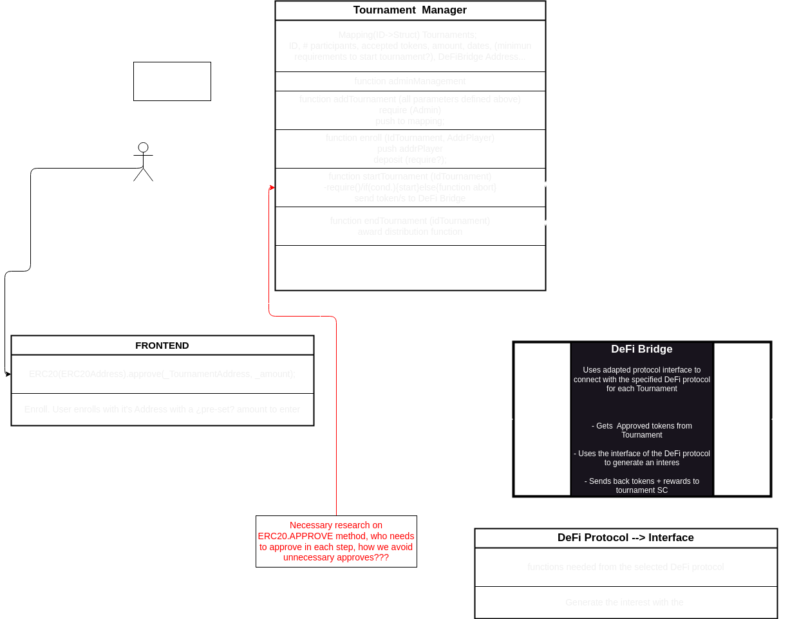
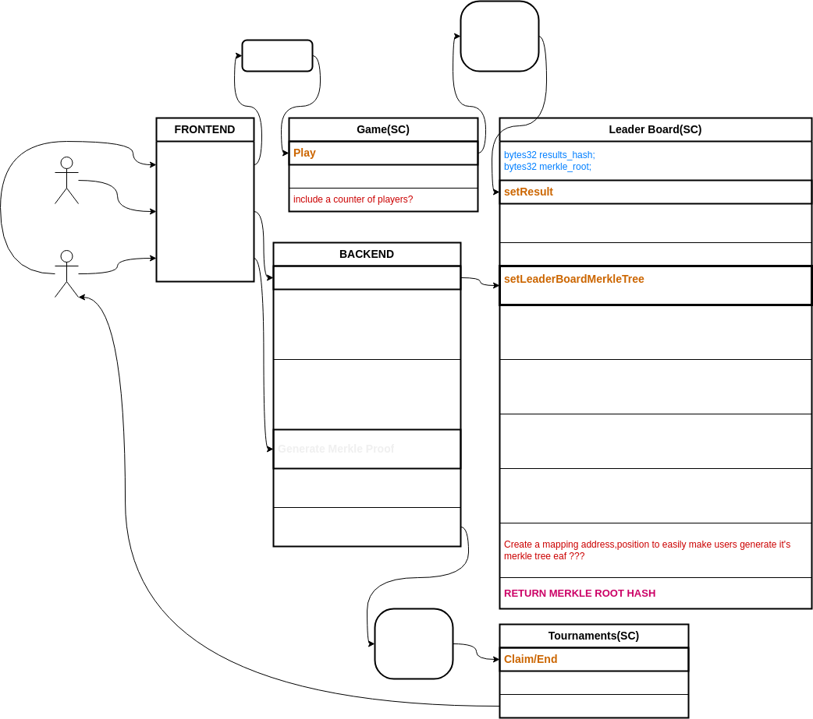

# Blockchain Tournaments FMP Project

Welcome to the Blockchain Tournaments FMP (Final Master's Project) Project! This project is a culmination of the BlockChain Technologies Master's Degree at the UPC Tech School.

## Overview
The Blockchain Tournaments FMP Project is a decentralized application (DApp) built using Solidity, Ethereum, and web technologies. It's designed to create and manage blockchain-based tournaments where participants can enroll by paying an entry fee. These tournaments accept various ERC20 tokens, which are then invested in different DeFi (Decentralized Finance) protocols to generate interest. The interest generated serves as the prize pool for tournament winners.

## Features

- **Tournament Creation**: Users can create new tournaments by specifying parameters like maximum and minimum participants, entry fee, acceptable ERC20 tokens, and more.

- **Tournament Enrollment**: Participants can enroll in tournaments by paying the specified entry fee and meeting the tournament's criteria.

- **DeFi Investment**: The project integrates with DeFi protocols to invest the funds collected from participants. This investment generates interest, which forms the tournament's prize pool.

- **Frontend Interface**: The project includes a user-friendly frontend web application where users can view, enroll in, and monitor tournaments.

## How It Works

- **Tournament Creation**: Users create new tournaments by specifying tournament parameters.

- **Tournament Enrollment**: Participants pay the entry fee and meet the tournament's requirements to enroll.

- **DeFi Investment**: Collected fees are invested in DeFi protocols to generate interest.

- **Tournament Progress**: Users can track the progress of tournaments and see the increasing prize pool.

- **Tournament Completion**: Tournaments are completed, and winners are determined based on predefined rules.

- **Claiming Rewards**: Winners can claim their rewards from the prize pool.

## Project Structure

The project consists of the following components:

- **Smart Contracts**: Ethereum smart contracts written in Solidity to manage tournaments, investments, and user interactions.

- **Frontend**: A web-based user interface built using web technologies like React.js to interact with the smart contracts and provide a user-friendly experience.

## Getting Started

To get started with the Blockchain Tournaments FMP Project, follow these steps:

1. **Clone the Repository**: Clone this GitHub repository to your local machine.

``` shell
git clone https://github.com/your-username/blockchain-tournaments-fmp.git
```

2. **Install Dependencies**: Navigate to the project directory and install the necessary dependencies for both the smart contracts and frontend.

```shell
cd blockchain-tournaments-fmp
npm install
```

3. **Compile and Deploy**: Compile the smart contracts and deploy them to your preferred Ethereum testnet or network.

4. **Start the Frontend**: Run the frontend application to interact with the smart contracts.

```shell
npm start
```

5. **Explore**: Open your web browser and visit http://localhost:3000 to explore and interact with the DApp.

## Project Flow Diagram
<br>



<br>



### Contributors

This project welcomes contributions from the open-source community. If you'd like to contribute, please fork the repository, make your changes, and submit a pull request.

### License

The Blockchain Tournaments FMP Project is open-source software licensed under the MIT License.

Thank you for your interest in the Blockchain Tournaments FMP Project. We hope you find it both educational and useful for your blockchain journey!


