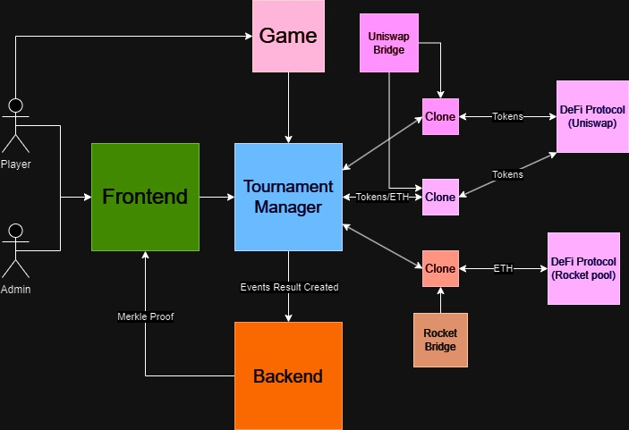

# Blockchain Tournaments FMP Project

Welcome to the Blockchain Tournaments FMP (Final Master's Project) Project! This project represents the culmination of the Blockchain Technologies Master's Degree at the UPC Tech School.

## Overview
The Blockchain Tournaments FMP Project is a decentralized application (DApp) built using Solidity and web technologies. It is designed for creating and managing blockchain-based tournaments where participants can enroll by paying an entry fee. These tournaments accept various ERC20 tokens, which are then invested in different DeFi (Decentralized Finance) protocols to generate interest. The interest generated serves as the prize pool for tournament winners. This project prioritizes trustless operations and has been implemented with modularity in mind.

<div style="text-align:center;">
  
</div>


## Technologies

The technologies used by this project:
- **Web**
    - Next.js
    - TailwindCSS
    - TypeScript
    - Scaffold
    - Vercel
- **Blockchain**
    - Solidity 
    - Hardhat
    - Goerli


## Project Structure

The project consists of the following components:

- **Smart Contracts**: The Ethereum smart contracts, written in Solidity, are responsible for managing tournaments, investments, and user interactions. Here are the main contract components:
    - **TournamentManager**: Main contract of the project, governs all tournaments, facilitates the collection of tokens, and enables tournament participants to claim their rewards.
    - **DeFi bridges**: Pre-deployed implementation smart contracts containing the logic to link our tournament manager with one accepted DeFi protocol.
    - **Clones**: These are OpenZeppelin Minimal Proxies that are used to connect to the DeFi Bridges and manage investments separately for each tournament.
    - **MajorHashGame**: A sample game created for explanatory purposes, illustrating the project's workflow.

- **Frontend**: The user interface, developed using web technologies such as React.js, allows users to interact with the smart contracts and provides an intuitive user experience. The frontend includes the following key views:
    - **Create Tournament**: Admin users can create an unlimited number of tournaments.
    - **Tournaments**: This view displays all available tournaments and allows users to enroll, play, and claim their tournament rewards. The frontend fetches data directly from the blockchain, ensuring transparency and real-time updates.
- **Backdend**: The backend component recreates the on-chain Merkle tree and manages other essential functions of the project.
## How It Works

- **Tournament Creation**:  Admins can create new tournaments by specifying parameters like maximum and minimum participants, entry fees, acceptable ERC20 tokens, and more. During the tournament's creation, a contract clone pointing to a "DeFi Bridge Smart Contract" is deployed. This clone manages the interaction with the DeFi protocol, providing two significant features. First, it allows for the independent management of investments for each tournament, and second, it enables the deployment of new DeFi Bridges to interact with other DeFi protocols.

- **Tournament Enrollment**: Participants can enroll in tournaments by paying the specified entry fee and meeting the tournament's criteria. A detailed explanation of the used protocols and investment timings will be provided.
 
- **Tournament Start**: When the enrollment period has finished, all the collected tokens are invested in the pre-set DeFi protocol.
  
-  **DeFi Investment**: The project integrates with DeFi protocols to invest the funds collected from participants. This investment generates interest, which forms the tournament's prize pool.


- **Tournament Play**: The game of the tournament could be either off-chain or on-chain. The project is designed to demonstrate and validate the classification by setting the game results for each player (just one play per player). Each accepted game should provide the player's address and a score, with the largest score determining the tournament winner. A hash of every result (address + score) is generated and hashed with the previous results to create and store a unique cryptographic summary of the tournament, which we called SpongeHash.

- **Tournament End**: When the end date arrives, the invested tokens are withdrawn, along with the rewards generated during the stake period. These are then sent to the main contract to enable users to claim their rewards. With all the results taken from the events a merkle root ordenated with the tournament clasification order would be stored. The input data will be verified by recreating the stored SpongeHash.

- **Claim**: Using the player's address, their position will be retrieved from the backend, and a merkle proof will be generated for the player to claim their reward. The claim will be enabled when the merkle proof is verified on-chain.
  


## Demo
[LINK](https://defi-smart-tournaments-tfm.vercel.app/)


## Getting Started

To get started with the Blockchain Tournaments FMP Project, follow these steps:

1. **Clone the Repository**: Clone this GitHub repository to your local machine.

``` shell
git clone https://github.com/TFM-Torneos-Blockchain/scaffoldVersion
```

2. **Install Dependencies**: Navigate to the project directory and install the necessary dependencies for both the smart contracts and frontend.

```shell
yarn install
```

3. **Compile and Deploy**: Compile the smart contracts and deploy them to your preferred Ethereum testnet or network.

4. **Start the Frontend**: Run the frontend application to interact with the smart contracts.

```shell
yarn start
```

5. **Run hardhat and deploy contracts**: Run the hardhat network and deploy the smart contracts.

```shell
yarn chain
yarn deploy
```


### Contributors

This project welcomes contributions from the open-source community. If you'd like to contribute, please fork the repository, make your changes, and submit a pull request.

### License

The Blockchain Tournaments FMP Project is open-source software licensed under the MIT License.

Thank you for your interest in the Blockchain Tournaments FMP Project. We hope you find it both educational and useful for your blockchain journey!


